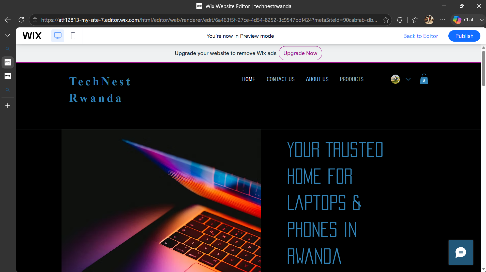
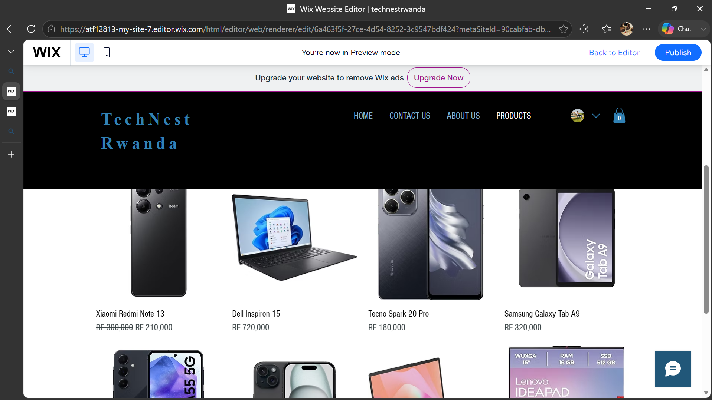
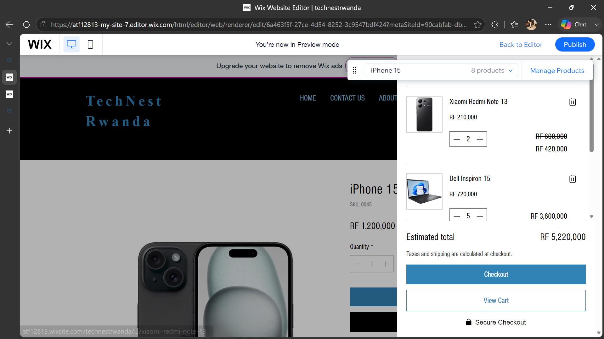

# TechNest Rwanda 🛍️
### Your Trusted Home for Laptops & Phones in Rwanda

---

## 👤 Student Information
- **Name:** Ahmed Atif
- **GitHub:** ahmedatif112
- **Course:** E-Commerce And Web Application | EWA408510
- **Academic Year:** 2025-2026 | Semester II
- **University:** University of Lay Adventists of Kigali (UNILAK)

---

## 📌 Project Title
**TechNest Rwanda** — No-Code E-Commerce Application Design Project

---

## 🛠️ Platform Used
- **Platform:** Wix
- **Type:** Online Store (No-Code/Low-Code)

---

## ✅ Features Implemented
- Homepage with store name, tagline, welcome message and Shop Now button
- Products page with 8 products including images, prices and descriptions
- About page with store story, mission and vision
- Contact page with contact form, phone, email and working hours
- Add to Cart button on every product
- Working shopping cart with item count in navigation
- Cart page and Thank You page after purchase
- Free delivery promotional banner
- Social media links in footer (X and Facebook)
- Fully mobile responsive design
- Why Choose Us section with 6 trust points

---

## 🛍️ Products Listed
| # | Product | Price (RWF) |
|---|---------|-------------|
| 1 | Samsung Galaxy A55 | 450,000 |
| 2 | iPhone 15 | 1,200,000 |
| 3 | HP Laptop 15s | 650,000 |
| 4 | Lenovo IdeaPad 3 | 550,000 |
| 5 | Samsung Galaxy Tab A9 | 320,000 |
| 6 | Tecno Spark 20 Pro | 180,000 |
| 7 | Dell Inspiron 15 | 720,000 |
| 8 | Xiaomi Redmi Note 13 | 210,000 |

---

## 📸 Screenshots

---

## 🚧 Challenges
- Replacing all placeholder template content with real store content
- Making sure all 8 products displayed correctly after deleting old template products
- Customizing the About and Contact pages to match the store identity
- Learning how Wix store manager works for the first time

---

## 📚 Lessons Learned
- How to build a professional e-commerce website without writing any code
- How to use Wix store manager to add and manage products
- How to structure a GitHub repository and write documentation in Markdown
- The importance of good UI/UX in making a store look trustworthy
- How cart functionality works in a no-code platform

---

## 🌐 Live Website
[Visit TechNest Rwanda](https://atf12813.wixsite.com/technestrwanda)

---

## 📁 GitHub Repository
[github.com/ahmedatif112/TechNest-Rwanda](https://github.com/ahmedatif112/TechNest-Rwanda)
